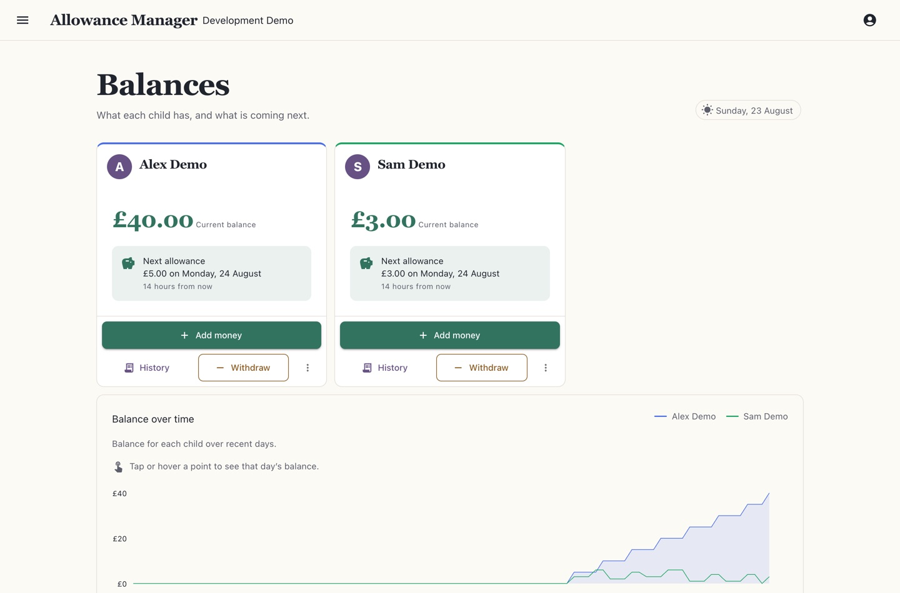
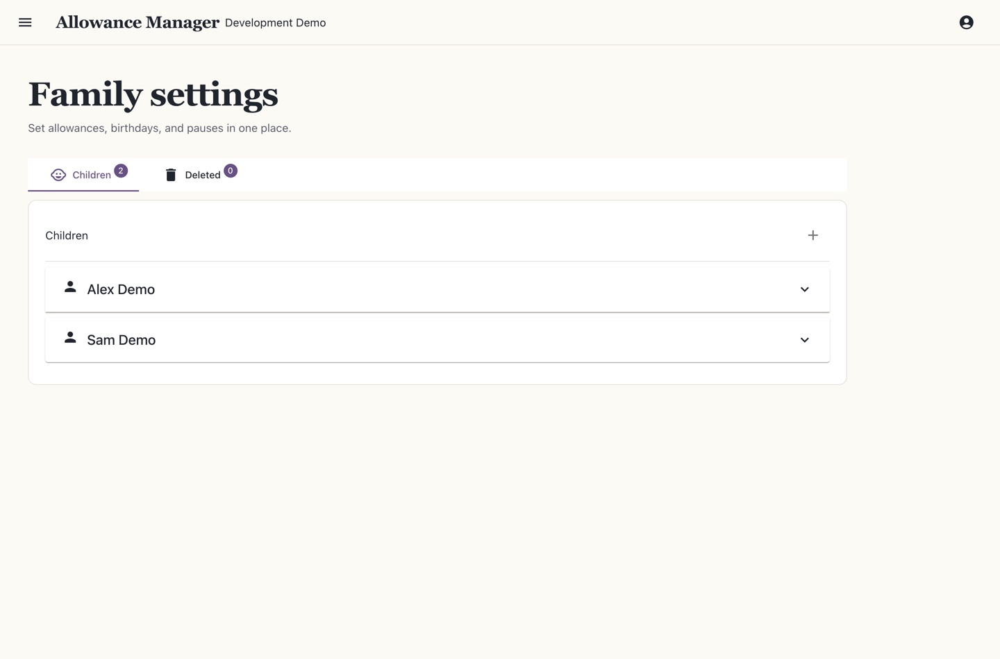

# Allowance Manager

Allowance Manager is an application for tracking child allowance and managing it semi-autonomously.

## Features

- Family switcher for people who belong to more than one family
- Invitations and family access management
- Allowance tracking for multiple children
- Configurable automatic daily allowance top-up
- Optional configurable birthday bonus allowance top-up
- Per-family time zone scheduling
- Allowance suspension for _n_ days
- Transaction history, export and correction
- Reversible restore for deleted families and children
- Parent login via an existing Microsoft account (personal or work)

## Screenshots

The screenshots below show the seeded Development experience.





## Requirements

- .NET 10 SDK 10.0.301 (pinned via `global.json`)
- PostgreSQL 14 or later
- Azure App Registration for OAuth2 authentication
- Blazor-compatible hosting (Azure App Service, for example)
- Migrations are applied by a deploy step - see [Database](#database)

## Container

Pushes to `main` and `v*` tags build and publish a Linux image to GitHub Container
Registry as `ghcr.io/<owner>/<repository>`. It listens on port `8080`; configure the
required production environment variables below and use `/health` for liveness and
`/health/ready` for readiness in the SaaS platform.

## Database

Apply database migrations explicitly with:

```bash
dotnet run --project ChildAllowanceManager -- --migrate
```

The command applies pending EF Core migrations and exits. The deployment workflow runs it before the production app deploy and then checks `/health/ready`; a pending migration or unavailable database leaves the app not ready. The regular `/health` endpoint is a database-free liveness probe.

When `ASPNETCORE_ENVIRONMENT=Development`, the application applies migrations and seeds the local demo data automatically. The explicit `--migrate` command does not seed demo data.

## Configuration

Configuration is read from `appsettings.json` and environment variables. Nested settings use `__` in environment variable names.

- **ConnectionStrings__Postgres** - required PostgreSQL connection string.
- **AzureMonitor__ConnectionString** - optional. When supplied, it enables Azure Monitor/Application Insights telemetry. Container Apps console logs are sent to the environment's configured Log Analytics workspace separately.
- **Authentication__Microsoft__ClientId** and **Authentication__Microsoft__ClientSecret** - required outside Development for Microsoft account sign-in.
- **FrameAncestors** - a JSON array of trusted embedding origins. The default empty array allows only `'self'`; add explicit origins when trusted embedding is needed. Wildcards are not allowed.
- **AllowedHosts** - production defaults to `allowance-manager.azurewebsites.net`; override it with the deployed host names. Development uses `*` for local hostnames.

For example, an environment variable named `FrameAncestors__0` adds the first allowed origin. When deployed to Azure App Service, configure these values as application settings (environment variables).

## Allowance schedule and family time zones

Set each family's time zone in **Family settings**. The allowance job wakes hourly and checks each family using its configured zone. A family is paid just after midnight in its own local time, and birthday checks use that same local date. A family with an unknown time zone falls back to UTC.

## Product rules

- A withdrawal may take a balance below zero. The resulting balance is shown, and the app asks for confirmation before submitting it.
- Delete is reversible. Families and children are hidden rather than destroyed and can be restored.
- Transactions are never edited. A correction writes a reversing transaction instead.
- Every money action records who performed it.

## Tests

Run the PostgreSQL-backed test suite with Docker:

```bash
bash scripts/test-postgres.sh
```

For an isolated per-agent database that keeps the shared container running, use:

```bash
CAM_TEST_DB=<name> CAM_TEST_KEEP=1 bash scripts/test-postgres.sh
```

The script starts PostgreSQL 16 when needed, runs the full solution test suite, and cleans up the test database or container afterward. CI runs the same PostgreSQL-backed suite.

## Brand

See [docs/brand/brand-guidelines.md](docs/brand/brand-guidelines.md) for the brand rules. No colour may be introduced outside [ChildAllowanceManager/wwwroot/tokens.css](ChildAllowanceManager/wwwroot/tokens.css); use the existing semantic tokens instead.
